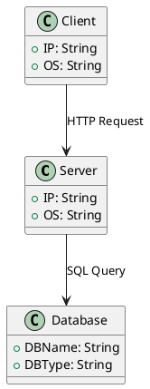

# データベースを使用するWebアプリケーションの構成図


# Webアプリケーションの配置図
```plantuml
@startuml
node "Client" {
  [Browser]
}

node "Server" {
  [Web Server]
  [Application Server]
}

node "Database" {
  [DB Server]
}

[Browser] --> [Web Server] : HTTP Request
[Web Server] --> [Application Server] : Internal Call
[Application Server] --> [DB Server] : SQL Query

@enduml
