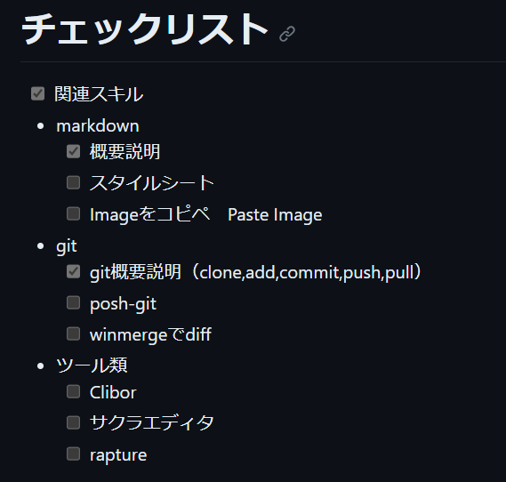

# 研修内容まとめ

↑ raptureで画像キャプチャして、Paste Imageの機能で貼り付け

参考サイト
[PCセットアップ](https://qiita.com/bonny_d/items/409d1c59fcc0c30f97ae)
## 環境構築
 > - [x] スタイルシート

VSCodeのmarkdownのプレビューにスタイルシートを適用して見やすくする
> - [x] Imageをコピペ　Paste Image

拡張機能をインストールしてコピペで自動にタグが貼り付けられるようにする
> - [x] posh-git

.gitconfigファイルに Posh-git を有効化して見やすくプロンプトをカスタマイズする
> - [x] winmergeでdiff

powershell から git windiff コマンドで変更前と変更後の差分の確認するときに使う
> - [x] Clibor

ctrl を2回押して起動。クリップボードの有効活用 　
> - [x] サクラエディタ

メモ帳から乗り換え。ハイライトなどコード変種作業に使いやすい
> - [x] rapture

画像キャプチャ。バグやエラーの画像をキャプチャして報告するなど。
