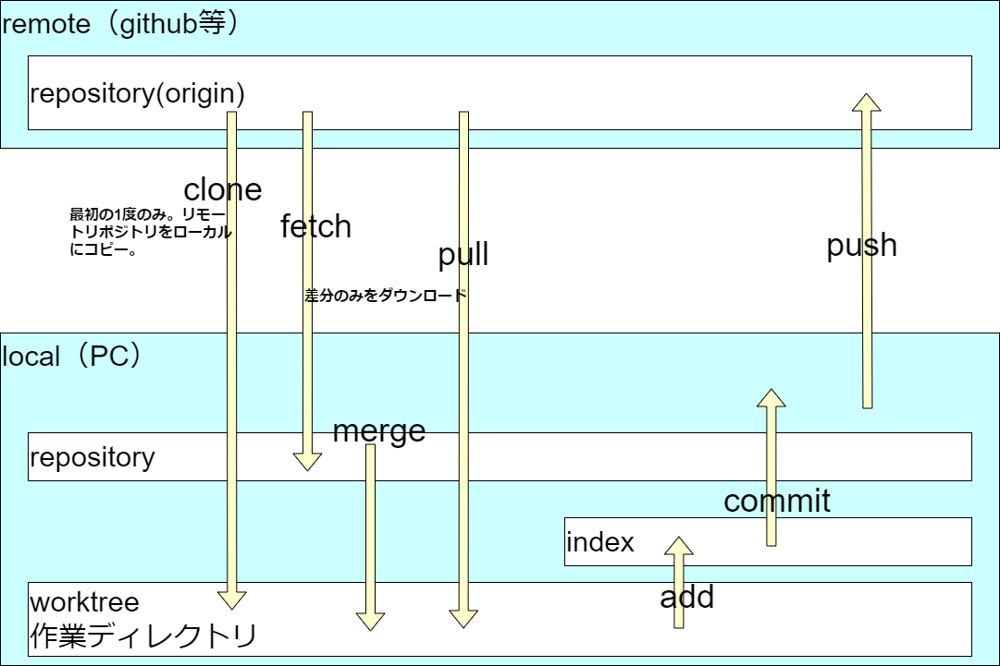

# 学習・環境構築
## はじめに
* 各ツールの保存先は下記にしましょう
  * C:\Users\[各ユーザ名]\Documents\tools
* 作業フォルダは下記にしましょう
  * C:\Users\[各ユーザ名]\Documents\work
* 会社のメールアドレスで、GitHubアカウントを作成しましょう　
  https://github.co.jp/ 

## 下記をダウンロード、インストール
* Visual Studio Code https://code.visualstudio.com/download
  * 下記日本語化拡張機能もインストール
  * 名前: Japanese Language Pack for Visual Studio Code 
ID: MS-CEINTL.vscode-language-pack-ja 
VS Marketplace リンク: https://marketplace.visualstudio.com/items?itemName=MS-CEINTL.vscode-language-pack-ja 

* サクラエディタ https://sakura-editor.github.io/
  * 最新版をダウンロード
  * exe、インストーラどちらでもOK
* clibor https://chigusa-web.com/clibor/
* rapture https://www.vector.co.jp/soft/dl/win95/art/se386376.html
## Git for Windowsをインストール
* ここからダウンロード、インストール https://gitforwindows.org/ 
  * 基本的にデフォルトのままでOK
  * 下記は[Run Git from the Windows Command Prompt]を選択

* インストール後、powershellを起動し、以下のコマンドを実行
```powershell
> git
usage: git [-v | --version] [-h | --help] [-C <path>] [-c <name>=<value>]
           [--exec-path[=<path>]] [--html-path] [--man-path] [--info-path]
　：
```
* 下記のようなエラーが出る場合、環境変数にパスが通っていない可能性があるので、環境変数を確認する。
```
git : 用語 'git' は、コマンドレット、関数、スクリプト ファイル、または操作可能なプログラムの名前として認識されません。名前が正しく記述されていることを確認し、パスが含まれている場合はそのパスが正しいことを確認し
てから、再試行してください。
```


## git、github概要
* gitとは？
  * 分散型バージョン管理システム
  * バージョン管理システムとは、ファイルの変更履歴を管理するシステム
  * 分散型とは、リモートリポジトリとローカルリポジトリの2つのリポジトリを持つこと
* リポジトリとは？
  * 保管庫。ソース等のファイル、成果物を保管する場所。
* gitのコマンドは全て、git xxxx という形式で実行する。
* リモートリポジトリ、ローカルリポジトリの連携イメージ
  
* [Git イラスト解説](https://qiita.com/takecho123/items/f7b56d09a3de210f8f78)
## スキルについて
* [システム開発に関連するスキル](https://github.com/mik-organization/edu-general/blob/main/000_%E4%B8%80%E8%88%AC/02_%E9%96%A2%E9%80%A3%E3%82%B9%E3%82%AD%E3%83%AB.png)
## Markdown
### VS CodeでMarkdownを使う環境を構築する
* 下記拡張機能をインストール
  * 名前: Markdown All in One 
ID: yzhang.markdown-all-in-one 
VS Marketplace リンク: https://marketplace.visualstudio.com/items?itemName=yzhang.markdown-all-in-one 
  * 名前: Markdown Preview Enhanced 
ID: shd101wyy.markdown-preview-enhanced 
VS Marketplace リンク: https://marketplace.visualstudio.com/items?itemName=shd101wyy.markdown-preview-enhanced 
  * 名前: markdownlint 
ID: DavidAnson.vscode-markdownlint 
VS Marketplace リンク: https://marketplace.visualstudio.com/items?itemName=DavidAnson.vscode-markdownlint 
  * 名前: Paste Image 
ID: mushan.vscode-paste-image 
VS Marketplace リンク: https://marketplace.visualstudio.com/items?itemName=mushan.vscode-paste-image 
* Markdownとは、文法について等々、ググって調べてみましょう。
## Qiita
* Qiitaアカウントを作成しましょう。
https://qiita.com/ 
* 記事の投稿について
  * 公開して問題の無い内容のものは、公開でOK
  * 特定のUdemyの講義に紐づくようなものは限定公開
  * 基本的に研修期間は無いが、個人情報とかお客様に関連する情報は記述NG
* 吉岡のQiitaアカウントは下記です。不都合無ければフォローしてください。
  * https://qiita.com/bonny_d
* Qiitaに備忘録の記事を作成し、日々学んだことをまとめて行きましょう。
まずはジャンル気にせず記入し、ある程度量が増えたら、随時カテゴリ分けしていきましょう。

## PowerShell を利用して作業効率UP
### PowerShell とは
* Windows に標準で搭載されているコマンドプロンプトのようなもの
* ただし、コマンドプロンプトよりも機能が豊富
* 例えば、コマンドプロンプトでは、コピー＆ペーストができないが、PowerShell ではできる
* また、コマンドプロンプトでは、コマンドの履歴を確認することができないが、PowerShell ではできる
* その他、様々な機能があるので、興味があれば調べてみてください。
### PowerShellで独自のエイリアスやショートカットを作成する
* https://qiita.com/bonny_d/items/a2f3a3ac59304609e42a
### posh-git
* https://qiita.com/bonny_d/items/409d1c59fcc0c30f97ae#powershell%E3%81%A7%E3%81%AEgit%E3%81%AE%E4%BD%BF%E7%94%A8%E3%82%92%E4%BE%BF%E5%88%A9%E3%81%AB%E3%81%99%E3%82%8B

## VSCode 拡張機能 
  * 名前: Draw.io Integration 
ID: hediet.vscode-drawio 
VS Marketplace リンク: https://marketplace.visualstudio.com/items?itemName=hediet.vscode-drawio 
  * 名前: Marp for VS Code 
ID: marp-team.marp-vscode 
VS Marketplace リンク: https://marketplace.visualstudio.com/items?itemName=marp-team.marp-vscode 
  * 名前: markdown-index 
ID: legendmohe.markdown-index 
VS Marketplace リンク: https://marketplace.visualstudio.com/items?itemName=legendmohe.markdown-index 
* PlantUML
  https://marketplace.visualstudio.com/items?itemName=jebbs.plantuml

## Markdownにスタイルシートをあてる
* https://qiita.com/bonny_d/items/409d1c59fcc0c30f97ae#markdown%E3%81%AE%E3%83%97%E3%83%AC%E3%83%93%E3%83%A5%E3%83%BC%E3%81%AB%E3%82%B9%E3%82%BF%E3%82%A4%E3%83%AB%E3%82%B7%E3%83%BC%E3%83%88%E3%82%92%E3%81%82%E3%81%A6%E3%82%8B

## winmergeでgit diff
* WinMergeをインストール https://winmergejp.bitbucket.io/ 
* https://qiita.com/bonny_d/items/409d1c59fcc0c30f97ae#winmerge%E3%81%A7diff%E3%81%AE%E8%A1%A8%E7%A4%BA%E3%83%9E%E3%83%BC%E3%82%B8%E3%81%A7%E3%81%8D%E3%82%8B%E3%82%88%E3%81%86%E3%81%AB

## データベース、SQLについて
* データベースとは？
  * データを蓄積するための仕組み
  * データベースには、様々な種類がある
    * Oracle、SQL Server、PostgreSQL、MySQL、SQLite、Accessなどなど
* SQLとは？
  * データベースに対して、操作を行う言語
  * データベースやスキーマの作成、データの登録、更新、削除、検索等を行う
  * 作成：create、登録：insert、更新：update、削除：delete、検索：select

* データベース、スキーマ等の階層構造イメージ


## spring boot でhelloworld
* https://qiita.com/momomo1998/items/37e48a3196b4761534c9

## データベース（Postgresql）導入
* https://qiita.com/momomo1998/items/ab1f0cc5ea8a632c7a68
* https://qiita.com/momomo1998/items/1b9d453d44920fa05e39


# 統合開発環境（IDE）インストール 
## java
* Eclipse https://mergedoc.osdn.jp 
開発対象：JAVA 
## C＃
### Visual Studio 
* ダウンロード 
※Communityをダウンロード する
※各リンクは変更される可能性アリ 

  * 2019　 
https://my.visualstudio.com/Downloads?q=Visual%20Studio%202019 
上記サイトより「Visual Studio Community 2019」の最新バージョンを選択 

* インストール 
特に指定が無い場合はデフォルトのまま進めること 

## その他 
* 推奨作業フォルダ 
C:\Users\USER\Documents\work 

  

# 学習 
## 参考サイト
### MarkDown 
* [Markdown記法チートシート](https://qiita.com/Qiita/items/c686397e4a0f4f11683d)
* [Markdown記法](https://www.markdown.jp/syntax/) 

### java
* [spring bootでhelloworld ](https://fresopiya.com/2019/09/14/webhello/)

