# MySqlのインストールと設定
## MySqlのインストール
  * mysqlインストール [参考サイト](https://qiita.com/aki_number16/items/bff7aab79fb8c9657b62)
    * version：8.4.2 LTS
      
      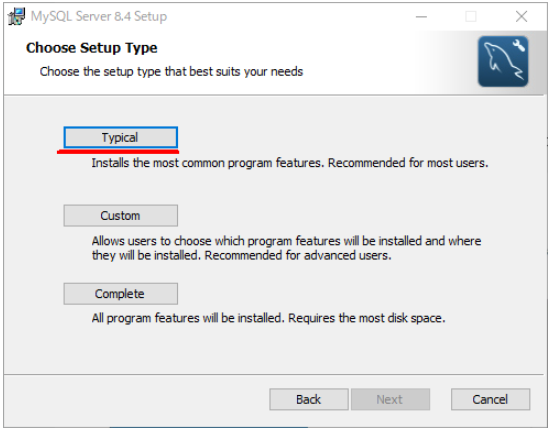  
  * MySQL Configuratorを起動後
    * 基本はそのままnext
      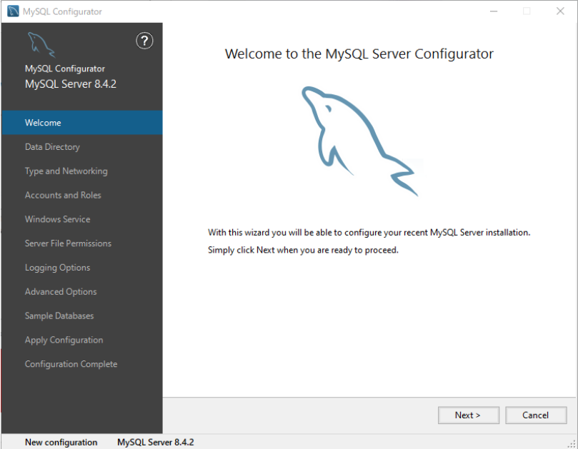    
    * Root Account Password  パスワードは"root"
      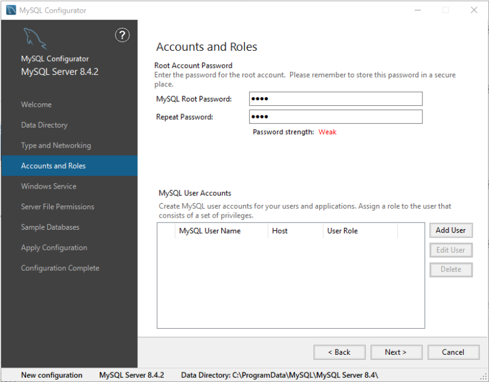
  * インストール後の確認
    * MySQL x.x Command Line Client を起動し、rootユーザのパスワードを入力してログインできればOK
      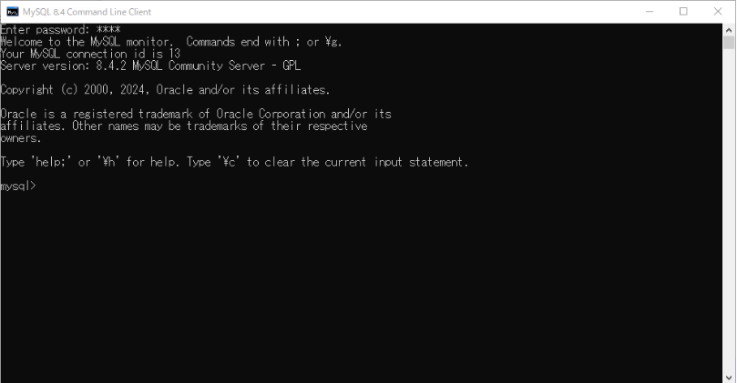
  * データベース"mik"の作成
    * 現在の データベースの確認
      
      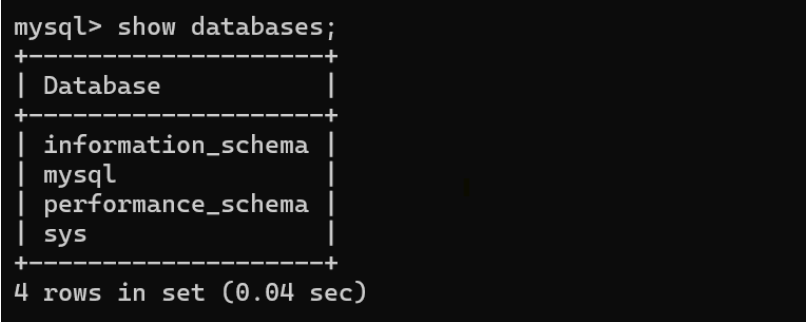
      
    * データベースの追加、確認
      コマンドは "create database mik;" に置き換える  
      コマンド実行後、"mik"が作成されていればOK  
      
      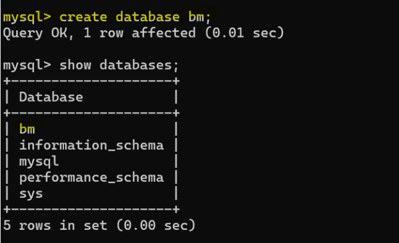
## A5のインストールと設定
### A5のインストール
* A5のインストール [参考サイト](https://www.a5m2.mmatsubara.com/)
### A5の設定
  * A5を開き、「データベース」を右クリック、「データベースの追加と削除」
    
    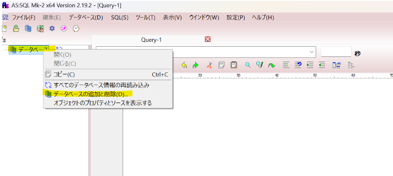
    
  * 「MY SQL」を選択
    
    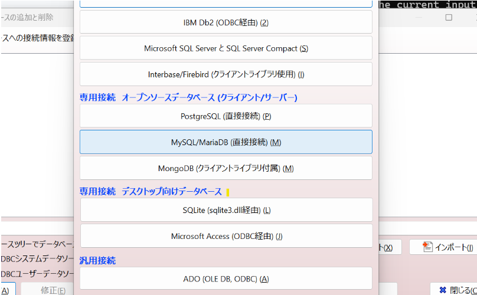
    
  * rootのパスワード。データベース名を選択
    データベースは"mik"を入力

    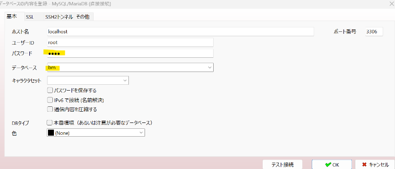
    
  * 別名を登録
    
    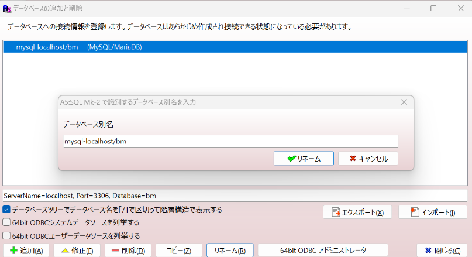
    
  * パスワード入力後、以下のように表示される
    
    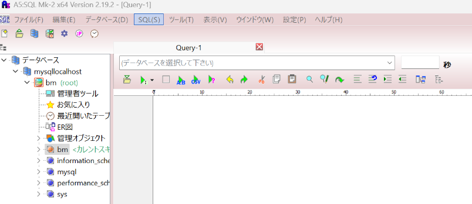

# その他mysql関連
* mysql ログインの仕方
  * mysql -u admin -p
  * admin

