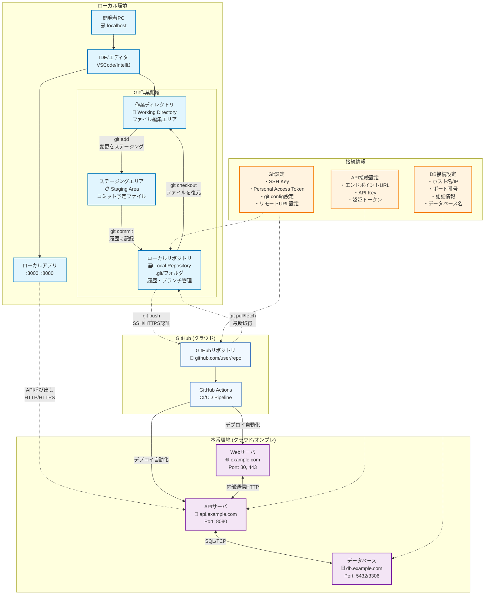

# 開発環境とシステム構成図

```mermaid
graph TB
    subgraph "ローカル環境"
        PC[開発者PC<br/>💻 localhost]
        IDE[IDE/エディタ<br/>VSCode/IntelliJ]
        LocalApp[ローカルアプリ<br/>:3000, :8080]
        
        subgraph "Git作業領域"
            WD[作業ディレクトリ<br/>📁 Working Directory<br/>ファイル編集エリア]
            SA[ステージングエリア<br/>📋 Staging Area<br/>コミット予定ファイル]
            LR[ローカルリポジトリ<br/>🗃️ Local Repository<br/>.git/フォルダ<br/>履歴・ブランチ管理]
        end
        
        PC --> IDE
        IDE --> LocalApp
        IDE --> WD
        WD -->|git add<br/>変更をステージング| SA
        SA -->|git commit<br/>履歴に記録| LR
        LR -->|git checkout<br/>ファイルを復元| WD
    end
    
    subgraph "GitHub (クラウド)"
        GH[GitHubリポジトリ<br/>🐙 github.com/user/repo]
        GA[GitHub Actions<br/>CI/CD Pipeline]
        
        GH --> GA
    end
    
    subgraph "本番環境 (クラウド/オンプレ)"
        WEB[Webサーバ<br/>🌐 example.com<br/>Port: 80, 443]
        API[APIサーバ<br/>🔧 api.example.com<br/>Port: 8080]
        DB[データベース<br/>🗄️ db.example.com<br/>Port: 5432/3306]
    end
    
    subgraph "接続情報"
        CONN1[Git設定<br/>・SSH Key<br/>・Personal Access Token<br/>・git config設定<br/>・リモートURL設定]
        CONN2[DB接続設定<br/>・ホスト名/IP<br/>・ポート番号<br/>・認証情報<br/>・データベース名]
        CONN3[API接続設定<br/>・エンドポイントURL<br/>・API Key<br/>・認証トークン]
    end
    
    LR -.->|git push<br/>SSH/HTTPS認証| GH
    GH -.->|git pull/fetch<br/>最新取得| LR
    LocalApp -.->|API呼び出し<br/>HTTP/HTTPS| API
    
    GA -->|デプロイ自動化| WEB
    GA -->|デプロイ自動化| API
    
    WEB <-->|内部通信HTTP| API
    API <-->|SQL/TCP| DB
    
    CONN1 -.-> LR
    CONN1 -.-> GH
    CONN2 -.-> DB  
    CONN3 -.-> API
    
    classDef local fill:#e1f5fe,stroke:#0277bd,stroke-width:2px
    classDef github fill:#f0f8ff,stroke:#4078c0,stroke-width:2px  
    classDef server fill:#f3e5f5,stroke:#7b1fa2,stroke-width:2px
    classDef config fill:#fff3e0,stroke:#f57c00,stroke-width:2px
    
    class PC,IDE,LocalApp,WD,SA,LR local
    class GH,GA github
    class WEB,API,DB server
    class CONN1,CONN2,CONN3 config
```